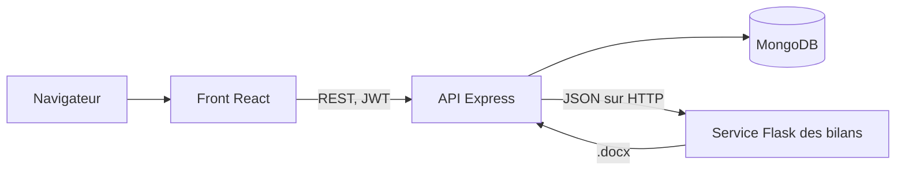

[English version](README.md)

# CAMELEA : plateforme d'évaluation neuropsychologique

Plateforme en production utilisée par un cabinet de neuropsychologie (Chalet Jonas). Le code source est privé ; ce dépôt documente le projet.

Rédiger un bilan neuropsychologique complet prenait plusieurs jours de cotation et de mise en forme manuelles. Il fallait convertir les scores avec les tables normatives des éditeurs, puis les recopier dans un document Word avec des tableaux et des graphiques pour chaque test. CAMELEA permet au cabinet d'enregistrer les patients, de saisir les résultats bruts des tests et d'obtenir la cotation immédiatement. La plateforme génère ensuite le bilan complet au format Word.

## Chronologie

- 2022 : un outil Python avec interface graphique. Je l'utilisais seul pour générer les bilans à partir des données envoyées par les spécialistes.
- 2023 : refonte en plateforme web multi-utilisateurs, pour que l'équipe soit autonome.
- 2024 : mise en production.
- 2024 à 2026 : maintenance et corrections ponctuelles.

J'ai été le seul développeur du début à la fin : j'ai conçu l'architecture, construit les trois services, et assuré le déploiement et le suivi avec le cabinet.

## Impact

- Plusieurs centaines de bilans produits.
- Un travail de plusieurs jours ramené à quelques secondes ou quelques minutes.
- Utilisée par moins d'une dizaine de professionnels.
- 22 tests et questionnaires psychométriques, dont WISC-V, WAIS-IV, WPPSI-IV, NEPSY-II, BRIEF, Vineland-II et DTVP-3.
- Environ 20 000 lignes de code réparties sur trois services.

## Architecture

La cotation se fait dans l'API Express, au moment de la saisie d'un test. Les scores sont stockés avec le patient, et le bilan ne les recalcule jamais.
Le service des bilans ne fait que la mise en page. Il reçoit du JSON, renvoie un fichier Word et n'accède pas à la base.
La mise en page est en Python parce que python-docx et matplotlib donnent un contrôle direct sur les tableaux Word et les graphiques.

## Moteur de cotation

- Chaque test a son propre module, avec la même interface. Il reçoit la saisie brute, l'âge et le genre du patient, et renvoie deux objets : les données du test stockées, et les données utilisées par le bilan.
- Un registre associe chaque nom de test à son module. Un seul endpoint gère la saisie de tous les tests.
- Les tables normatives sont stockées dans MongoDB, un document par test. Un module ne charge que les parties qui correspondent à la tranche d'âge du patient.
- Les modules calculent les notes composites, les rangs percentiles et les intervalles de confiance au niveau choisi par l'examinateur.
- Pour le QIT, un subtest manquant peut être remplacé par un subtest de substitution autorisé, ou le score peut être calculé au prorata. Les deux cas sont signalés et affichés dans le bilan.
- Quand la date de naissance ou le genre d'un patient est corrigé, seuls les tests qui dépendent de l'âge ou du genre sont recotés.

## Contrôle d'accès et journal d'activité

- Trois rôles principaux : praticien, examinateur et parent. Un administrateur délivre les clés des comptes praticiens.
- Les comptes sont créés avec des clés d'activation à usage unique. Un praticien obtient des clés pour ses examinateurs. Une clé parent est créée avec chaque patient et peut être envoyée à la famille par email.
- Le praticien attribue des droits à chaque examinateur : ajouter des patients, modifier les informations d'un patient, retirer des tests, remplir des tests, générer des bilans, consulter les clés des parents.
- Des règles par test et par rôle sont stockées en base. Elles définissent qui peut remplir quel test, et si la vérification passe par le compte du praticien.
- Les parents ont leur propre compte et remplissent à distance les questionnaires qui leur sont attribués (BRIEF, BRIEF-A, BISHOP, HIPIC, EQ-AQ-SQ).
- Les sessions utilisent un access token et un refresh token stocké dans un cookie httpOnly. Le mot de passe peut être réinitialisé avec un code à usage unique envoyé par email.
- Chaque action sur un patient, un test, une clé ou un bilan est inscrite dans un journal d'activité. Le journal garde les 500 dernières entrées par cabinet et enregistre les valeurs avant et après pour les modifications de tests.

## Génération des bilans

- Le document Word est construit de zéro avec python-docx. Aucun modèle Word n'est utilisé.
- Le bilan commence par les informations du patient et un sommaire par catégories, puis une section par test, une conclusion, des recommandations et des annexes.
- Chaque section a son propre renderer, avec des tableaux et des graphiques matplotlib (profils des subtests, profils des composites avec intervalles de confiance).
- Les libellés et descriptions viennent d'un fichier JSON qui contient une version française et une version anglaise de chaque texte. Un bilan est généré en français ou en anglais.
- Deux versions : complète, et école. La version école garde six tests (WISC-V, WAIS-IV, KITAP, TAP, DTVP-3, DTVP-A-2), n'affiche que le tableau principal de chaque test et retire les annexes.

## Fonctionnement

Toutes les données affichées sont fictives. L'interface est en français.

1. La liste des patients affiche le statut de chaque dossier.

2. Un nouveau patient est créé avec les tests demandés pour le bilan.

3. Les notes brutes d'un test sont saisies dans un seul formulaire, regroupées par indice (ici le WISC-V).

4. Une fois tous les tests saisis, la fiche du patient indique chaque test comme complété.

5. Le bilan est généré en français ou en anglais, en version complète ou école.

## Le bilan généré

L'en-tête « Cabinet Démo » est celui du mode démonstration.

Profil des subtests et tableau des composites du WISC-V, bilan en français.

Profil des composites et comparaison des indices du WISC-V, bilan en anglais.

Annexe de la BRIEF, formulaire enseignant : note brute, note T, rang percentile et intervalle de confiance pour chaque échelle, bilan en français.

## Rôles et traçabilité

Gestion des examinateurs : chaque examinateur a une clé d'activation et un ensemble de droits. Les clés d'activation sont floutées.

Journal d'activité : détail d'une modification de test, avec la valeur avant et après.

## Extraits de code

- [snippets/test-registry-and-access.js](snippets/test-registry-and-access.js) : registre des tests et contrôle d'accès par rôle et par test avant la cotation.
- [snippets/targeted-rescoring.js](snippets/targeted-rescoring.js) : recote seulement les tests concernés par un changement de date de naissance ou de genre.
- [snippets/wisc-norm-loading.js](snippets/wisc-norm-loading.js) : charge seulement les tables normatives du WISC-V utiles pour la tranche d'âge du patient.
- [snippets/wisc-section-renderer.py](snippets/wisc-section-renderer.py) : génère la section WISC-V d'un bilan.
- [snippets/report-assembly.py](snippets/report-assembly.py) : assemble le bilan par catégories et filtre les tests pour la version école.

Ce sont des extraits d'un code privé. Ils ne s'exécutent pas seuls.

## Ce que je ferais autrement

- Écrire des tests automatisés dès le départ, au moins pour chaque module de cotation.
- Vérifier les autorisations dans un seul middleware plutôt que dans chaque contrôleur.
- Utiliser une seule bibliothèque d'interface. Le front mélange Material-UI 4 et MUI 5.
- Générer des données de démonstration avec un script, pour pouvoir lancer et montrer la plateforme sans aucune donnée réelle.

## Stack

- Front : React 17.0.2, React Router 6.11, MUI 5.13 et Material-UI 4.12, Formik 2.4, Recharts 2.1.
- API : Node.js 22.2, Express 4.18, Mongoose 7.1 sur MongoDB, jsonwebtoken 9, bcrypt 5.1, Nodemailer 6.9.
- Service des bilans : Python 3.11, Flask 2.2.3 avec Waitress 2.1.2, python-docx 0.8.11, matplotlib 3.7.1, pandas 1.5.3.

## Auteur

Mohamed Tazi, [linkedin.com/in/mohamed-tazi-dev](https://www.linkedin.com/in/mohamed-tazi-dev)
