[Version française](README.fr.md)

# CAMELEA: a neuropsychological assessment platform

Production platform used by a neuropsychology practice (Chalet Jonas). Source code is private; this repository documents the project.

Writing a full neuropsychological report used to take several days of manual scoring and formatting. Scores had to be converted with the publishers' norm tables, then copied into a Word document with tables and charts for each test. CAMELEA lets the practice register patients, enter raw test results, and get scored results immediately. It then generates the complete report as a Word document.

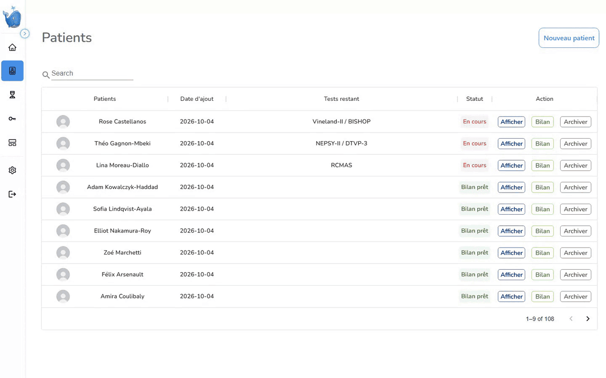

## Timeline

- 2022: a Python desktop tool with a graphical interface. I used it alone to generate reports from the data sent by the specialists.
- 2023: rebuilt as a multi-user web platform so the team could work without me.
- 2024: production release.
- 2024 to 2026: occasional maintenance and fixes.

I was the only developer from start to finish: I designed the architecture, built the three services, and handled deployment and follow-up with the practice.

## Impact

- Several hundred reports produced.
- Work that took several days now takes a few seconds to a few minutes.
- Used by fewer than ten professionals.
- 22 psychometric tests and questionnaires, including WISC-V, WAIS-IV, WPPSI-IV, NEPSY-II, BRIEF, Vineland-II and DTVP-3.
- About 20,000 lines of code across three services.

## Architecture

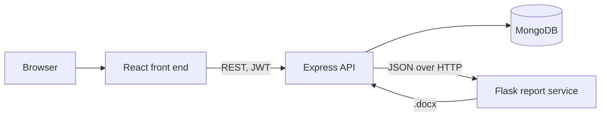

Scoring runs in the Express API when a test is entered. Scores are stored with the patient, so the report never recomputes them.
The report service only does layout. It receives JSON, returns a Word file and has no database access.
Python was used for layout because python-docx and matplotlib give direct control over Word tables and charts.

## Scoring engine

- Each test has its own module with the same interface. It takes the raw input, the patient's age and gender, and returns two objects: the stored test data and the data used by the report.
- A registry maps each test name to its module. One endpoint handles test entry for all tests.
- Norm tables are stored in MongoDB, one document per test. A module loads only the parts that match the patient's age band.
- Modules compute composite scores, percentile ranks and confidence intervals at the level chosen by the examiner.
- For full-scale IQ, a missing subtest can be replaced by an allowed substitute, or the score can be prorated. Both cases are flagged and printed as a notice in the report.
- When a patient's birthdate or gender is corrected, only the tests that depend on age or gender are scored again.

## Access control and audit

- Three main roles: practitioner, examiner and parent. An administrator issues the keys for practitioner accounts.
- Accounts are created with single-use activation keys. A practitioner gets keys for their examiners. A parent key is created with each patient and can be sent to the family by email.
- A practitioner gives each examiner a set of rights: add patients, edit patient information, remove tests, fill tests, generate reports, view parent keys.
- Rules per test and per role are stored in the database. They define who may fill which test, and whether the check goes through the practitioner's account.
- Parents get their own account and fill the questionnaires assigned to them (BRIEF, BRIEF-A, BISHOP, HIPIC, EQ-AQ-SQ) remotely.
- Sessions use an access token and a refresh token stored in an httpOnly cookie. Passwords can be reset with a one-time code sent by email.
- Every action on a patient, test, key or report is written to an activity log. The log keeps the last 500 entries per practice and stores before and after values for test updates.

## Report generation

- The Word document is built from scratch with python-docx. No Word template is used.
- The report opens with patient information and a summary by category, then one section per test, a conclusion, recommendations and annexes.
- Each section has its own renderer, with tables and matplotlib charts (subtest profiles, composite profiles with confidence intervals).
- All labels and descriptions come from one JSON file that holds a French and an English version of each text. A report is generated in French or in English.
- Two versions: full, and school. The school version keeps six tests (WISC-V, WAIS-IV, KITAP, TAP, DTVP-3, DTVP-A-2), prints only the main table per test, and leaves out annexes.

## How it works

All data shown is fictional. The interface is in French.

1. The patient list shows the status of each file.

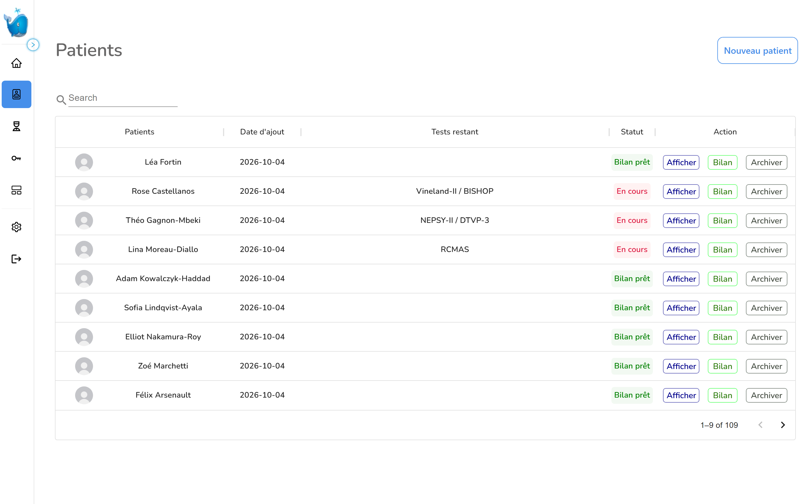

2. A new patient is created with the tests requested for the assessment.

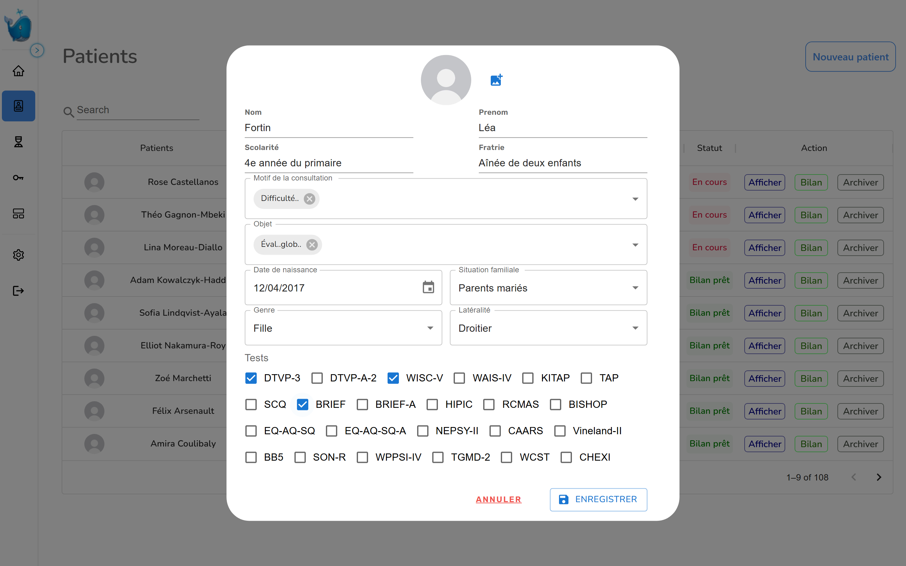

3. The raw scores of a test are entered in one form, grouped by index (here the WISC-V).

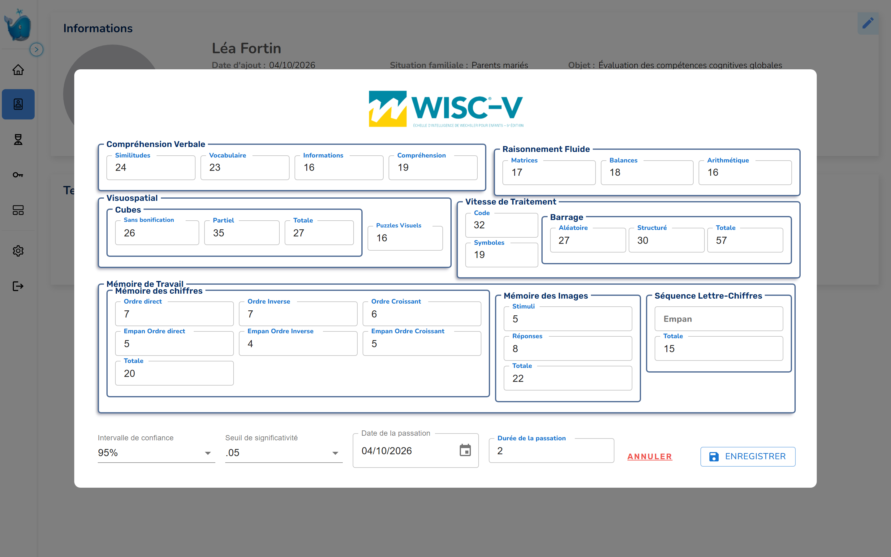

4. Once all tests are entered, the patient record shows each test as completed.

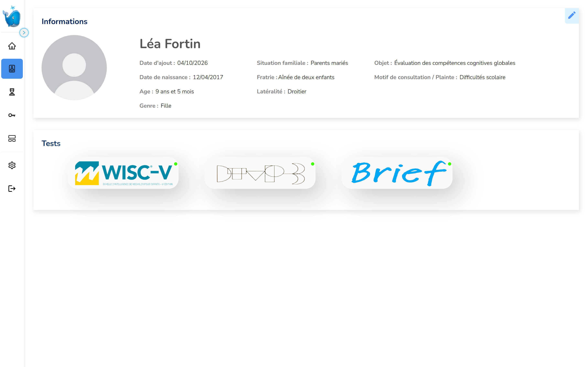

5. The report is generated in French or in English, in the full or the school version.

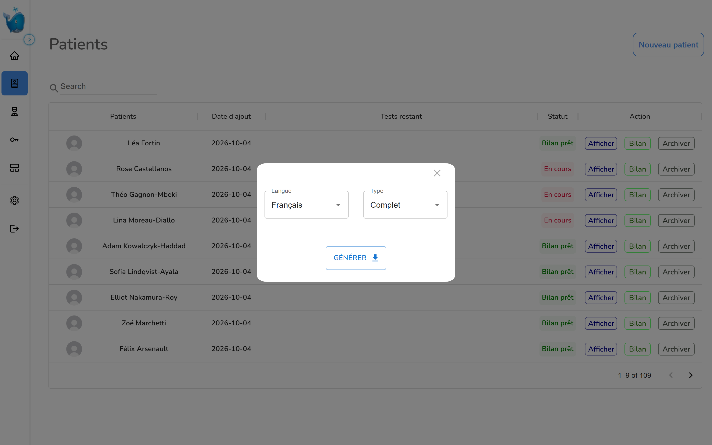

## The generated report

The "Cabinet Démo" header ("Demo Practice" in English) is the one used in demonstration mode.

WISC-V subtest profile and composite table, French report.

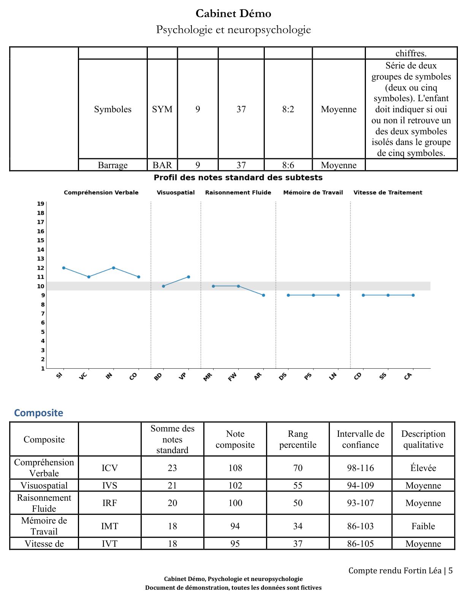

WISC-V composite profile and index comparisons, English report.

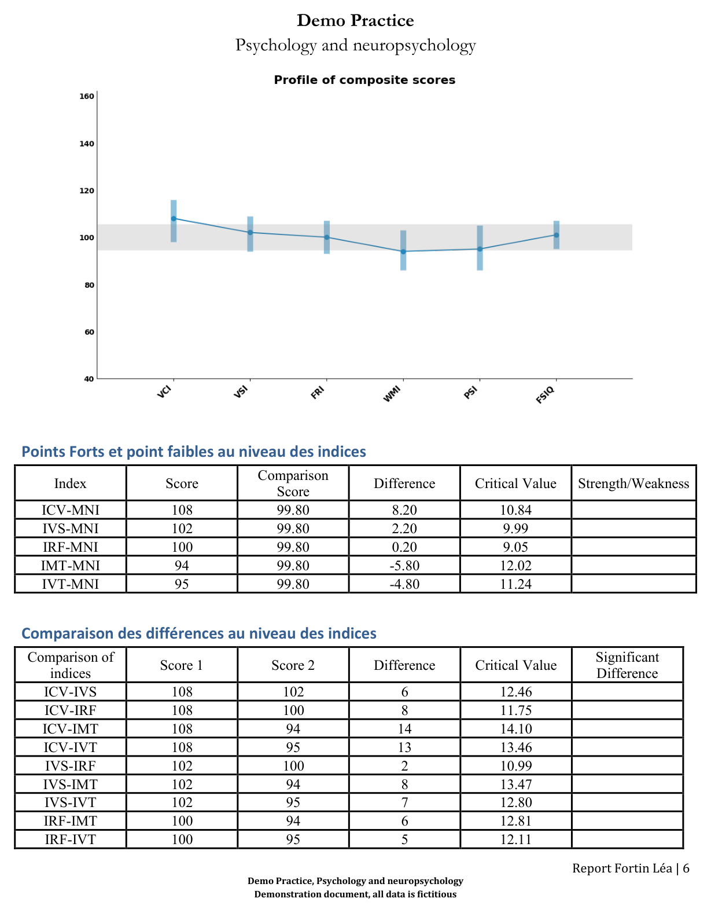

BRIEF annex, teacher form: raw score, T score, percentile and confidence interval for each scale, French report.

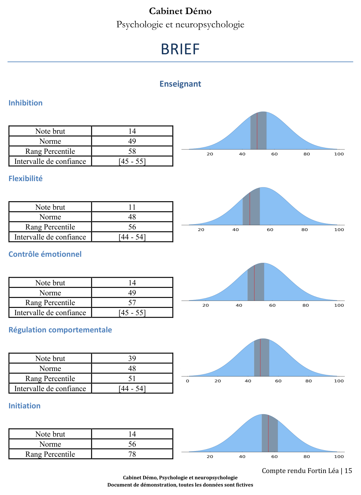

## Roles and audit

Examiner management: each examiner has an activation key and a set of rights. Activation keys are blurred.

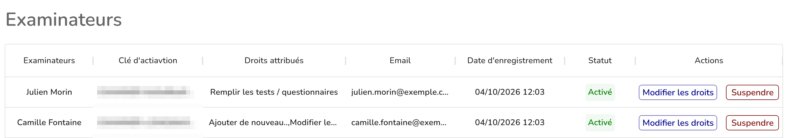

Activity log: detail of a test update, with the value before and after.

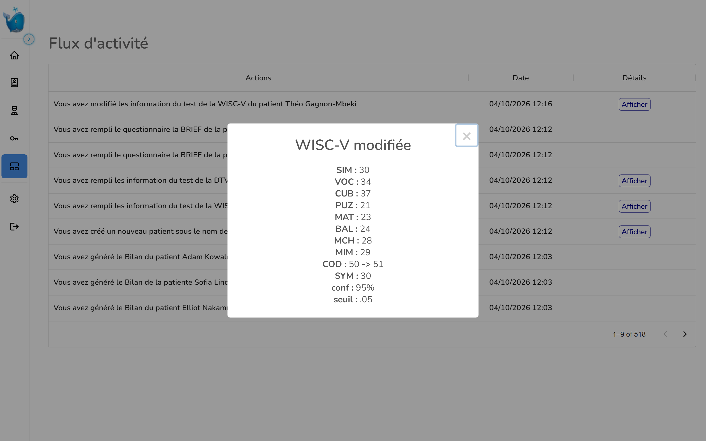

## Code excerpts

- [snippets/test-registry-and-access.js](snippets/test-registry-and-access.js): test registry and the per-role, per-test access check before scoring.
- [snippets/targeted-rescoring.js](snippets/targeted-rescoring.js): scores again only the tests affected by a change of birthdate or gender.
- [snippets/wisc-norm-loading.js](snippets/wisc-norm-loading.js): loads only the WISC-V norm tables needed for the patient's age band.
- [snippets/wisc-section-renderer.py](snippets/wisc-section-renderer.py): renders the WISC-V section of a report.
- [snippets/report-assembly.py](snippets/report-assembly.py): assembles the report by category and filters tests for the school version.

These are excerpts from a private codebase. They are not runnable on their own.

## Stack

- Front end: React 17.0.2, React Router 6.11, MUI 5.13 and Material-UI 4.12, Formik 2.4, Recharts 2.1.
- API: Node.js 22.2, Express 4.18, Mongoose 7.1 on MongoDB, jsonwebtoken 9, bcrypt 5.1, Nodemailer 6.9.
- Report service: Python 3.11, Flask 2.2.3 with Waitress 2.1.2, python-docx 0.8.11, matplotlib 3.7.1, pandas 1.5.3.

## Author

Mohamed Tazi, [linkedin.com/in/mohamed-tazi-dev](https://www.linkedin.com/in/mohamed-tazi-dev)
